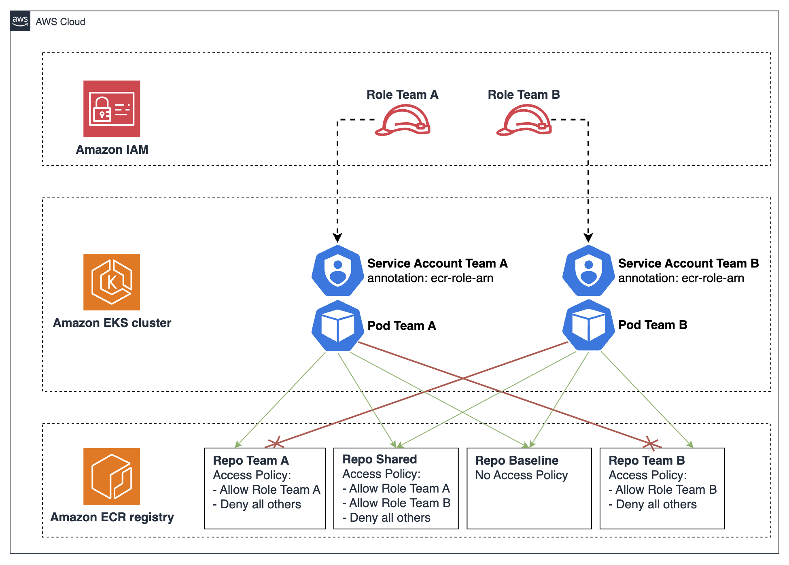

# Per-Pod Amazon ECR Image Pull Permissions on Amazon EKS

Scope Amazon ECR image pull permissions to individual Kubernetes pods using per-pod credentials and ECR repository policies. Different workloads on the same node get different ECR access without blanket node-level permissions.

## Problem

By default, every pod on an Amazon EKS node shares the same image pull credentials (the node's IAM role). If the node can pull an image, any pod on that node can too. There's no way to say "this pod can pull from repo A but not repo B."

This matters when teams share a cluster but own separate ECR repositories. A pod in team-a's namespace shouldn't be able to pull team-b's container images, even if they run on the same node.

## Solution

This approach uses Kubernetes [KEP 4412](https://www.kubernetes.dev/resources/keps/4412/) (Beta in K8s 1.34) to pass a pod's ServiceAccount token to the kubelet's credential provider plugin. The [Amazon ECR credential provider](https://github.com/kubernetes/cloud-provider-aws/pull/1155) exchanges that token for ECR credentials scoped to a specific IAM role via STS `AssumeRoleWithWebIdentity`.

Two enforcement layers work together:

**1. Per-pod credentials (kubelet + ecr-credential-provider)**

Kubelet `CredentialProviderConfig` is updated with `tokenAttributes` at node boot. This configures the kubelet to pass ServiceAccount tokens to the ECR credential provider for all image pulls. The provider then decides internally which credentials to use:

- If the pod's Service Account has an `eks.amazonaws.com/ecr-role-arn` annotation → call AWS Security Token Service (AWS STS) `AssumeRoleWithWebIdentity` with the Service Account token → use the assumed role's credentials for ECR.
- If the pod's Service Account doesn't have `ecr-role-arn` annotation → fall back to the node's IAM role (same behavior as before KEP 4412).

Existing workloads and system pods (VPC CNI, kube-proxy, CoreDNS) continue to work unchanged because they don't have the `ecr-role-arn` annotation, so the provider falls back to the node role.

**2. Repository-level deny (ECR repo policies)**

Each team's ECR repository manages access using a repository policy that explicitly denies all principals except the team's ECR IRSA role. This blocks the node role and other teams' roles from pulling private team images.

Four ECR repositories illustrate this feature:
- **team-a/app:** Repository policy denies all principals except team-a's ECR IRSA role
- **team-b/app:** Repository policy denies all principals except team-b's ECR IRSA role
- **shared/app:** Repository policy allows both team-a and team-b ECR IRSA roles
- **baseline/app:** Default - No repository policy (any AWS principal can pull images, including EKS node role)

## Architecture




### The Full Flow

```
Pod with ecr-role-arn annotation (team a/b service account):
    │
    ├─ kubelet passes SA token to ecr-credential-provider
    │  → provider sees ecr-role-arn annotation on SA
    │  → calls STS AssumeRoleWithWebIdentity
    │  → gets credentials scoped to team ECR role
    │    → access to team's own repo: repo policy allows → pull succeeds ✅
    │    → access to shared repo: repo policy allows both teams → pull succeeds ✅
    │    → access to other team's repo: repo policy denies → pull fails ❌
    │    → baseline repo: no repo policy → pull succeeds ✅
    │
Pod without ecr-role-arn annotation (default SA):
    │
    ├─ kubelet passes SA token to ecr-credential-provider
    │  → provider sees NO ecr-role-arn annotation
    │  → falls back to node role
    │    → access to baseline repo: no repo policy → pull succeeds ✅
    │    → access to shared repo: repo policy denies node role → pull fails ❌
    │    → access to team repos: repo policy denies node role → pull fails ❌
```

### Requirements

Three requirements must be met for per-pod credentials to work:

1. **Kubernetes >= 1.34.** The `KubeletServiceAccountTokenForCredentialProviders` feature gate is beta and enabled by default starting in 1.34. This is what allows the kubelet to project SA tokens to credential providers.
2. **ECR credential provider with `tokenAttributes` support.** The provider must understand the `tokenAttributes` config and the `ecr-role-arn` annotation. Available in [cloud-provider-aws PR #1155](https://github.com/kubernetes/cloud-provider-aws/pull/1155) or later. EKS nodes running K8s 1.34+ include this version.
3. **RBAC audience permission applied before nodes join.** The kubelet needs permission to request SA tokens with the `sts.amazonaws.com` audience. Without the ClusterRole/ClusterRoleBinding in place, the kubelet cannot project tokens and **all image pulls fail**, including system pods. The node will not become Ready.

## Demo

The Terraform configuration creates:

- **Amazon Virtual Private Cloud (Amazon VPC):** 2 AZs, public/private subnets, single NAT gateway
- **EKS cluster:** managed control plane with EKS addons: kube-proxy, vpc-cni, coredns
- **Managed node group:** AL2023 nodes with UserData that writes a `CredentialProviderConfig` with `tokenAttributes` to enable per-pod ECR credentials
- **RBAC:** ClusterRole and ClusterRoleBinding granting kubelet permission to project SA tokens with the `sts.amazonaws.com` audience (must exist before nodes join)
- **ECR repositories:** `shared/app`, `team-a/app`, `team-b/app`, `baseline/app` 
- **ECR repository policies:** `team-a/app`, `team-b/app`, and `shared/app` deny all (`ecr:*`) except their allowed ECR IRSA roles and an Admin push role. `baseline/app` has **no** repository policy, showing the default behavior without protection.
- **ECR IRSA roles:** one per team, with OIDC trust (namespace-scoped `StringLike`) and same ECR pull permissions as EKS nodes.

### Prerequisites

- AWS account with permissions to create VPC, EKS, ECR, IAM resources
- [Terraform](https://developer.hashicorp.com/terraform/install) >= 1.5
- [AWS CLI](https://docs.aws.amazon.com/cli/latest/userguide/getting-started-install.html) v2
- `kubectl`
- A container runtime (docker, podman, or finch) for pushing images to ECR

> **Warning:** This demo creates billable AWS resources including a NAT gateway, Amazon EKS cluster control plane, Amazon Elastic Compute Cloud (Amazon EC2) instances, and Amazon ECR repositories. Costs will accrue while resources are running. To minimize costs, complete the demo promptly and run the cleanup steps when finished. For current pricing, see the [Amazon EKS pricing page](https://aws.amazon.com/eks/pricing/), [Amazon EC2 pricing page](https://aws.amazon.com/ec2/pricing/), and [Amazon ECR pricing page](https://aws.amazon.com/ecr/pricing/).


### 1. Configure

Edit `infra-tf/terraform.tfvars`:

| Variable | Description | Default |
|---|---|---|
| `aws_region` | AWS region for all resources | — |
| `cluster_name` | EKS cluster name | — |
| `cluster_version` | Kubernetes version (>= 1.34 for KEP 4412) | `1.35` |
| `node_instance_type` | Amazon EC2 instance type for nodes | `t3.medium` |

### 2. Deploy infrastructure

```bash
./scripts/create-infra.sh
```

This creates the VPC, EKS cluster, managed node group with the credential provider config, ECR repositories with repo policies, and IRSA roles.

### 3. Configure kubectl

```bash
$(terraform -chdir=infra-tf output -raw configure_kubectl)
```

### 4. Push images to ECR

```bash
./scripts/build-push-images.sh
```

This auto-detects your container runtime (docker, podman, or finch), authenticates to ECR, and pushes nginx to all four repos: `shared/app`, `team-a/app`, `team-b/app`, `baseline/app`.

### 5. Deploy test manifests

```bash
./scripts/apply-manifests.sh
```

This applies namespaces and all team deployment manifests (each includes its own ServiceAccount and Deployment). Variables are populated from Terraform outputs via `envsubst`.

### 6. Verify

```bash
echo "=== team-a ==="
kubectl get pods -n team-a
echo ""
echo "=== team-b ==="
kubectl get pods -n team-b
echo ""
echo "=== no-ecr-irsa (node role fallback) ==="
kubectl get pods -n no-ecr-irsa
```

<details>
<summary>Expected output</summary>

```
=== team-a ===
NAME                              READY   STATUS             RESTARTS   AGE
team-a-to-own-xxxxx               1/1     Running            0          2m
team-a-to-team-b-xxxxx            0/1     ImagePullBackOff   0          2m
team-a-to-shared-xxxxx            1/1     Running            0          2m
team-a-to-baseline-xxxxx          1/1     Running            0          2m

=== team-b ===
NAME                              READY   STATUS             RESTARTS   AGE
team-b-to-own-xxxxx               1/1     Running            0          2m
team-b-to-team-a-xxxxx            0/1     ImagePullBackOff   0          2m
team-b-to-shared-xxxxx            1/1     Running            0          2m
team-b-to-baseline-xxxxx          1/1     Running            0          2m

=== no-ecr-irsa (node role fallback) ===
NAME                              READY   STATUS             RESTARTS   AGE
no-ecr-irsa-to-team-a-xxxxx      0/1     ImagePullBackOff   0          2m
no-ecr-irsa-to-shared-xxxxx      0/1     ImagePullBackOff   0          2m
no-ecr-irsa-to-baseline-xxxxx    1/1     Running            0          2m
```

</details>

Eleven pods across three identity types demonstrate per-pod credential isolation. The `baseline/app` repository acts as a control with no ECR repository policy, showing the default behavior where any AWS principal can pull. The protected repos (`team-a/app`, `team-b/app`, `shared/app`) show how repository policies enforce team-level isolation.

Each team workload has its own ServiceAccount annotated with the team's ECR IRSA role ARN. The ECR IRSA role trust policy uses `StringLike` to allow any ServiceAccount within the team's namespace to assume the role, so you don't need to update the trust policy when new workloads are added. Just annotate your pod ServiceAccount with your team's ECR IRSA role and your workloads can pull from your private repositories.

**Team A**

| Deployment | ECR Image | ServiceAccount | Credential Used | Result |
|---|---|---|---|---|
| `team-a-to-own` | `team-a/app` | `sa-team-a-to-own` | IRSA role (team-a) | ✅ Running |
| `team-a-to-team-b` | `team-b/app` | `sa-team-a-to-team-b` | IRSA role (team-a) | ❌ Denied by repo policy |
| `team-a-to-shared` | `shared/app` | `sa-team-a-to-shared` | IRSA role (team-a) | ✅ Running |
| `team-a-to-baseline` | `baseline/app` | `sa-team-a-to-baseline` | IRSA role (team-a) | ✅ Running |

**Team B**

| Deployment | ECR Image | ServiceAccount | Credential Used | Result |
|---|---|---|---|---|
| `team-b-to-own` | `team-b/app` | `sa-team-b-to-own` | IRSA role (team-b) | ✅ Running |
| `team-b-to-team-a` | `team-a/app` | `sa-team-b-to-team-a` | IRSA role (team-b) | ❌ Denied by repo policy |
| `team-b-to-shared` | `shared/app` | `sa-team-b-to-shared` | IRSA role (team-b) | ✅ Running |
| `team-b-to-baseline` | `baseline/app` | `sa-team-b-to-baseline` | IRSA role (team-b) | ✅ Running |

**No ECR IRSA (default ServiceAccount, node role fallback)**

| Deployment | ECR Image | ServiceAccount | Credential Used | Result |
|---|---|---|---|---|
| `no-ecr-irsa-to-team-a` | `team-a/app` | `default` | Node role (fallback) | ❌ Denied by repo policy |
| `no-ecr-irsa-to-shared` | `shared/app` | `default` | Node role (fallback) | ❌ Denied by repo policy |
| `no-ecr-irsa-to-baseline` | `baseline/app` | `default` | Node role (fallback) | ✅ Running |

Pods without an ECR IRSA role annotation fall back to the node role, which can access the baseline repository but is denied access to protected team repositories.

### 7. Inspect the failures

ECR repository policy denies cross-team access to private repositories.

```bash
# team-a-to-team-b: team-a IRSA role denied by team-b repo policy
kubectl describe pod -l app=team-a-to-team-b -n team-a | tail -10

# team-b-to-team-a: team-b IRSA role denied by team-a repo policy
kubectl describe pod -l app=team-b-to-team-a -n team-b | tail -10

# no-ecr-irsa-to-team-a: node role denied by team-a repo policy
kubectl describe pod -l app=no-ecr-irsa-to-team-a -n no-ecr-irsa | tail -10
```

<details>
<summary>Expected output: team-a-to-team-b (denied pull from team-b repo)</summary>

```
Events:
  Type     Reason     Age                  From               Message
  ----     ------     ----                 ----               -------
  Normal   Scheduled  3m32s                default-scheduler  Successfully assigned team-a/team-a-to-team-b-xxxxx to ip-10-0-1-17.ec2.internal
  Normal   Pulling    35s (x5 over 3m31s)  kubelet            Pulling image "12345EXAMPLE.dkr.ecr.us-east-1.amazonaws.com/team-b/app:latest"
  Warning  Failed     35s (x5 over 3m31s)  kubelet            Failed to pull image: 403 Forbidden
  Warning  Failed     35s (x5 over 3m31s)  kubelet            Error: ErrImagePull
  Normal   BackOff    9s (x12 over 3m30s)  kubelet            Back-off pulling image
  Warning  Failed     9s (x12 over 3m30s)  kubelet            Error: ImagePullBackOff
```

</details>

### 8. Inspect node credential provider config

```bash
NODE=$(kubectl get nodes -o jsonpath='{.items[0].metadata.name}')
kubectl debug node/$NODE -it --image=ubuntu -- \
  cat /host/etc/eks/image-credential-provider/config.json
```

<details>
<summary>Expected output</summary>

```json
{
  "apiVersion": "kubelet.config.k8s.io/v1",
  "kind": "CredentialProviderConfig",
  "providers": [
    {
      "name": "ecr-credential-provider",
      "matchImages": [
        "*.dkr.ecr.*.amazonaws.com",
        "*.dkr-ecr.*.on.aws",
        "*.dkr.ecr.*.amazonaws.com.cn",
        "*.dkr-ecr.*.on.amazonwebservices.com.cn",
        "*.dkr.ecr-fips.*.amazonaws.com",
        "*.dkr-ecr-fips.*.on.aws",
        "*.dkr.ecr.*.c2s.ic.gov",
        "*.dkr.ecr.*.sc2s.sgov.gov",
        "*.dkr.ecr.*.cloud.adc-e.uk",
        "*.dkr.ecr.*.csp.hci.ic.gov",
        "*.dkr.ecr.*.amazonaws.eu",
        "public.ecr.aws",
        "ecr-public.aws.com"
      ],
      "defaultCacheDuration": "12h0m0s",
      "apiVersion": "credentialprovider.kubelet.k8s.io/v1",
      "tokenAttributes": {
        "serviceAccountTokenAudience": "sts.amazonaws.com",
        "cacheType": "ServiceAccount",
        "requireServiceAccount": false,
        "optionalServiceAccountAnnotationKeys": [
          "eks.amazonaws.com/ecr-role-arn"
        ]
      }
    }
  ]
}
```

</details>

This block shows the credential provider configuration applied to EKS nodes at boot time. The `tokenAttributes` block tells the kubelet to project a ServiceAccount token for every image pull. The provider then checks whether the SA has an `ecr-role-arn` annotation: if present, it assumes that role; otherwise, it falls back to the node role.

### 9. Cleanup

> **Warning:** This cleanup will permanently delete all resources.

The `terraform destroy` command automatically deletes ECR repositories and all images within them (`force_delete = true`).

Delete K8s resources, then destroy infrastructure:

```bash
./scripts/apply-manifests.sh delete
./scripts/cleanup.sh
```

## Project Structure

```
.
├── README.md
├── scripts/
│   ├── create-infra.sh       # terraform init + apply
│   ├── build-push-images.sh  # push nginx to all 4 ECR repos
│   ├── apply-manifests.sh    # apply/delete K8s manifests with envsubst
│   └── cleanup.sh            # terraform destroy
├── infra-tf/
│   ├── providers.tf
│   ├── variables.tf
│   ├── terraform.tfvars
│   ├── vpc.tf
│   ├── eks.tf                # EKS cluster + node group + RBAC
│   ├── iam-roles.tf          # IRSA roles + policies per team
│   ├── ecr.tf                # ECR repos + repo policies
│   └── outputs.tf
└── manifest/
    ├── namespaces.yaml
    ├── team-a-to-own.yaml             # team-a → team-a/app    (✅ IRSA)
    ├── team-a-to-team-b.yaml          # team-a → team-b/app    (❌ denied by repo policy)
    ├── team-a-to-shared.yaml          # team-a → shared/app    (✅ IRSA)
    ├── team-a-to-baseline.yaml        # team-a → baseline/app  (✅ no repo policy)
    ├── team-b-to-own.yaml             # team-b → team-b/app    (✅ IRSA)
    ├── team-b-to-team-a.yaml          # team-b → team-a/app    (❌ denied by repo policy)
    ├── team-b-to-shared.yaml          # team-b → shared/app    (✅ IRSA)
    ├── team-b-to-baseline.yaml        # team-b → baseline/app  (✅ no repo policy)
    ├── no-ecr-irsa-to-team-a.yaml     # default SA → team-a/app    (❌ denied by repo policy)
    ├── no-ecr-irsa-to-shared.yaml     # default SA → shared/app    (❌ denied by repo policy)
    └── no-ecr-irsa-to-baseline.yaml   # default SA → baseline/app  (✅ no repo policy)
```

## How It Works

### Inside the credential provider: IRSA vs node role

The decision between IRSA and node role happens **inside** the credential provider binary. When invoked, it runs this logic ([source](https://github.com/kubernetes/cloud-provider-aws/)):

```
1. Does the request include a ServiceAccountToken?
   └─ No  → use default AWS SDK credential chain (node role via IMDS)
   └─ Yes → continue...

2. Does the SA have an "eks.amazonaws.com/ecr-role-arn" annotation?
   └─ No  → check AWS_ECR_ROLE_ARN env var
            └─ Not set → use default AWS SDK credential chain (node role via IMDS)
            └─ Set → use that ARN, continue...
   └─ Yes → continue...

3. Call STS AssumeRoleWithWebIdentity with the SA token and role ARN
   └─ Success → use the assumed role credentials for ECR GetAuthorizationToken
   └─ Failure → error (NO fallback to node role; the image pull fails)
```

Key points:

- The provider checks specifically for `eks.amazonaws.com/ecr-role-arn`, **not** `eks.amazonaws.com/role-arn`. These are different annotations. Pods can still use `role-arn` for runtime AWS API access because the ECR provider ignores that annotation entirely.
- If the annotation is not found, the provider checks the `AWS_ECR_ROLE_ARN` environment variable as a fallback ARN source. If neither is set, it uses the default credential chain (node role).
- If the SA **does** have `ecr-role-arn` and `AssumeRoleWithWebIdentity` succeeds, those credentials are used even if they lack ECR permissions for the target repo. There is no secondary fallback to the node role after a successful assume.

### System pods (VPC CNI, kube-proxy, CoreDNS) are unaffected

System pods have ServiceAccounts annotated with `eks.amazonaws.com/role-arn` (for runtime AWS API access like managing ENIs). The ECR credential provider ignores this annotation and only looks for `ecr-role-arn`. Since system SAs don't have `ecr-role-arn`, the provider falls back to the node role for their image pulls. This is the same behavior as before KEP 4412.


## Conclusion

Per-pod Amazon ECR image pull permissions on Amazon EKS provide fine-grained access control for container images. By combining Kubernetes KEP 4412 with ECR repository policies, you can enforce team-level isolation while maintaining operational simplicity. System pods continue to work unchanged, and the node role fallback ensures compatibility with existing workloads.

## References

- [KEP 4412 — Projected Service Account Tokens for Kubelet Image Credential Providers](https://www.kubernetes.dev/resources/keps/4412/)
- [Kubernetes v1.34: SA Tokens for Image Pulls Beta](https://kubernetes.io/blog/2025/09/03/kubernetes-v1-34-sa-tokens-image-pulls-beta/)
- [AWS ECR Credential Provider — ServiceAccountToken Support](https://github.com/kubernetes/cloud-provider-aws/pull/1155)
